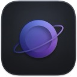
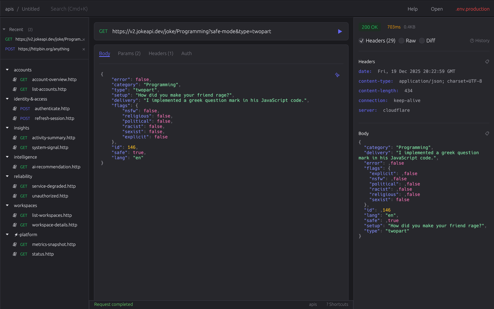

<p align="center">
  
</p>

<h1 align="center">Mercury</h1>

<p align="center">
  <strong>API Testing for Purists.</strong><br>
  Instant startup. 60fps UI. $0 forever.
</p>

<p align="center">
  <a href="https://harry-kp.github.io/mercury/docs/getting-started">Documentation</a> •
  <a href="https://github.com/Harry-kp/mercury/releases">Download</a> •
  <a href="https://github.com/users/Harry-kp/projects/5">Roadmap</a> •
  <a href="#philosophy">Philosophy</a> •
  <a href="#contributing">Contributing</a>
</p>

<p align="center">
  <a href="https://github.com/Harry-kp/mercury/releases"></a>
  <a href="https://github.com/Harry-kp/mercury/actions"></a>
  <a href="https://github.com/Harry-kp/mercury/blob/master/LICENSE"></a>
  
</p>

<p align="center">
  <a href="https://github.com/Harry-kp/mercury/stargazers"></a>
  <a href="https://github.com/Harry-kp/mercury/issues"></a>
  <a href="https://github.com/Harry-kp/mercury/pulls"></a>
  <a href="https://github.com/Harry-kp/mercury/discussions"></a>
</p>

<p align="center">
  
</p>

## Why Mercury?

| | Postman | Insomnia | **Mercury** |
|---|---|---|---|
| **Startup** | 3-5 sec | 2-4 sec | **<300ms** |
| **Frame Rate** | Sluggish | Sluggish | **60fps native** |
| **Input Lag** | 50-100ms | 30-50ms | **<16ms** |
| **Binary Size** | ~500MB | ~400MB | **6MB** |
| **Price** | $14-25/mo | $5-18/mo | **Free forever** |
| **Scrolling** | Janky | Okay | **Buttery smooth** |

> *Mercury uses ~100MB RAM to render at 60fps with native GPU acceleration. Electron apps use 500MB+ to feel like a slow website.*

---

## Philosophy

> *"Build half a product, not a half-assed product."* — 37signals

Mercury is built on principles, not features:

- **⚡ Native Rust** — Real performance, not wrapped web pages
- **📁 Files, not databases** — Your requests are just files. Grep them. Git them.
- **🔒 Truly local** — We don't have servers. Your secrets stay yours.
- **⌨️ Keyboard-first** — Your hands never leave the keyboard
- **🚫 No bloat** — No AI, no collaboration, no features you'll never use

---

## Installation

### ⚡ Fastest Way (30 seconds)

**macOS / Linux:**
```bash
curl --proto '=https' --tlsv1.2 -LsSf https://github.com/Harry-kp/mercury/releases/latest/download/mercury-installer.sh | sh
```

**Windows (PowerShell):**
```powershell
irm https://github.com/Harry-kp/mercury/releases/latest/download/mercury-installer.ps1 | iex
```

**Then launch:**
```bash
mercury
```
> 💡 If you get "command not found", restart your terminal or run `source ~/.zshrc`

---

### 🖥️ Want it in your Applications folder?

The installer puts `mercury` in `~/.cargo/bin`. If you prefer launching from Spotlight/Start Menu:

<details>
<summary><strong>macOS: Add to Applications + Dock</strong></summary>

```bash
# One-liner: creates Mercury.app you can add to Dock
mkdir -p /Applications/Mercury.app/Contents/MacOS && \
cp ~/.cargo/bin/mercury /Applications/Mercury.app/Contents/MacOS/ && \
cat > /Applications/Mercury.app/Contents/Info.plist << 'EOF'
<?xml version="1.0" encoding="UTF-8"?>
<!DOCTYPE plist PUBLIC "-//Apple//DTD PLIST 1.0//EN" "http://www.apple.com/DTDs/PropertyList-1.0.dtd">
<plist version="1.0">
<dict>
    <key>CFBundleExecutable</key>
    <string>mercury</string>
    <key>CFBundleName</key>
    <string>Mercury</string>
    <key>CFBundleIdentifier</key>
    <string>com.mercury.app</string>
</dict>
</plist>
EOF
```
Now search "Mercury" in Spotlight (⌘ Space) and drag to Dock!

</details>

<details>
<summary><strong>Windows: Pin to Start Menu</strong></summary>

1. Open File Explorer → `%USERPROFILE%\.cargo\bin\`
2. Right-click `mercury.exe` → **Create shortcut**
3. Right-click the shortcut → **Pin to Start**

</details>

<details>
<summary><strong>Linux: Add to app launcher</strong></summary>

```bash
cat > ~/.local/share/applications/mercury.desktop << 'EOF'
[Desktop Entry]
Name=Mercury
Exec=$HOME/.cargo/bin/mercury
Type=Application
Categories=Development;
EOF
```

</details>

---

### 🔧 Troubleshooting

<details>
<summary><strong>🍎 macOS: "developer cannot be verified" error</strong></summary>

1. Run `mercury` (it will fail)
2. **System Settings → Privacy & Security** → Click **"Allow Anyway"**
3. Run `mercury` again

Or run: `xattr -d com.apple.quarantine ~/.cargo/bin/mercury`

</details>

<details>
<summary><strong>🪟 Windows: "Windows protected your PC"</strong></summary>

Click **"More info"** → **"Run anyway"**

</details>

<details>
<summary><strong>📦 Manual Download</strong></summary>

📦 **[Download from Releases](https://github.com/Harry-kp/mercury/releases)** — macOS (Intel/ARM), Windows, Linux

```bash
# Extract and run
tar -xf mercury-*.tar.xz && chmod +x mercury && ./mercury
```

</details>

<details>
<summary><strong>🛠️ Build from Source</strong></summary>

```bash
git clone https://github.com/Harry-kp/mercury.git
cd mercury
cargo build --release
./target/release/mercury
```

</details>

---

## Shortcuts

| Shortcut | Action |
|----------|--------|
| `⌘ Enter` | Send request |
| `⌘ S` | Save request |
| `⌘ K` | Search |
| `⌘ N` | New request |
| `⌘ Shift F` | Focus mode |
| `⌘ H` | History |
| `Esc` | Cancel request |
| `?` | All shortcuts |

---

## File Format

Your requests are plain text. Version control friendly. No lock-in.

```http
# Simple GET request
GET https://api.example.com/users

# POST with headers and body
POST https://api.example.com/users
Content-Type: application/json
Authorization: Bearer {{token}}

{
  "name": "John Doe",
  "email": "john@example.com"
}

# Using environment variables
GET {{base_url}}/users/{{user_id}}
Authorization: Bearer {{api_key}}
```

Variables like `{{token}}` are loaded from `.env` files in your workspace.

---

## Features

- **Live File Sync** — Edit in VS Code, updates instantly. Two-way sync.
- **Auto-Save** — Changes are persisted immediately. Never lose work.
- **Collections** — Organize requests in folders
- **Environments** — `.env` file support with `{{variable}}` syntax
- **History** — Timeline of all requests with restore
- **Focus Mode** — Distraction-free editing
- **cURL Import** — Paste cURL commands directly
- **Collection Import** — Import from Postman or Insomnia
- **Request Cancellation** — Stop runaway requests instantly
- **Syntax Highlighting** — JSON responses beautifully formatted
- **Dark Mode** — Easy on the eyes, built for late nights

---

## Defaults

Mercury uses sensible defaults so you can focus on your API, not configuration:

| Setting | Default | Behavior |
|---------|---------|----------|
| **Timeout** | 30 seconds | Requests fail after 30s of no response |
| **Redirects** | Followed | HTTP redirects are followed automatically (up to 10) |

---

## What Mercury is NOT

We intentionally don't build:

- ❌ Cloud sync
- ❌ Team collaboration  
- ❌ AI assistants
- ❌ Plugins/extensions
- ❌ User accounts
- ❌ Analytics/telemetry

These aren't missing features. They're features we chose not to build.

---

## Contributing

Mercury is open source. PRs welcome.

```bash
# Development
cargo run

# Tests
cargo test

# Release build
cargo build --release
```

---

## License

MIT License — do whatever you want.

---

<p align="center">
  Built with obsessive minimalism.<br>
  <a href="https://github.com/Harry-kp">@Harry-kp</a>
</p>
