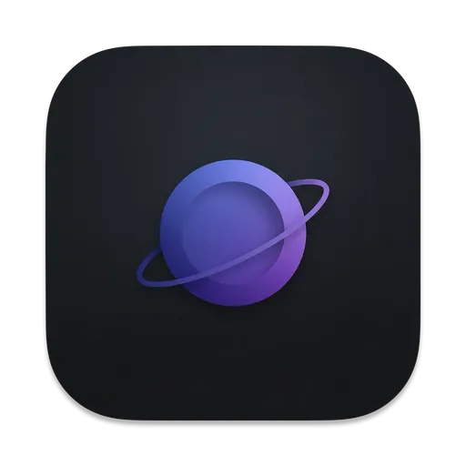
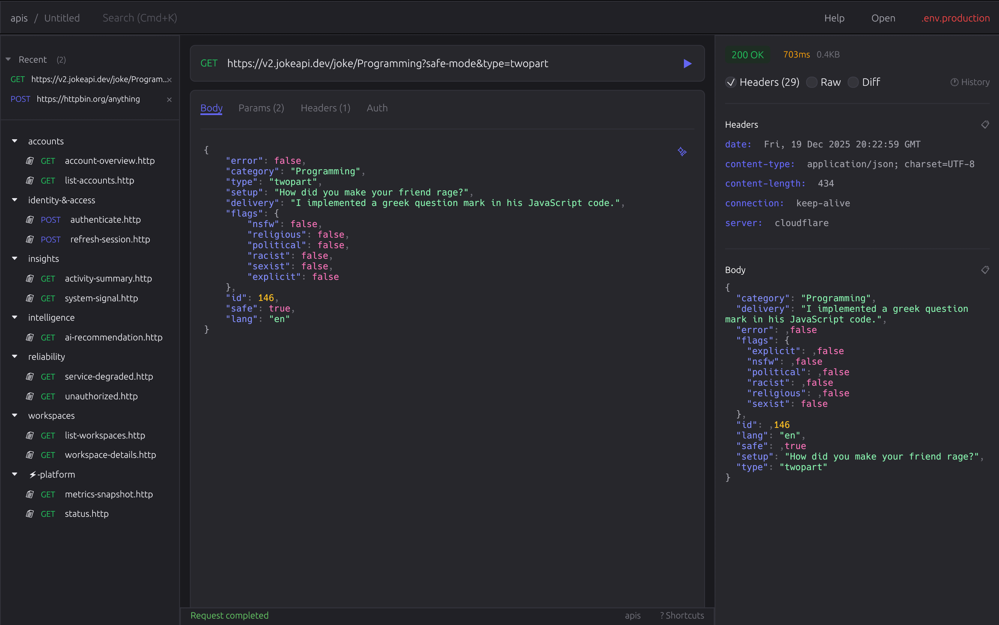

<p align="center">
  
</p>

<h1 align="center">Mercury</h1>

<p align="center">
  <strong>API Testing for Purists.</strong><br>
  Instant startup. 60fps UI. $0 forever.
</p>

<p align="center">
  <a href="https://harry-kp.github.io/mercury/docs/getting-started">Documentation</a> •
  <a href="https://github.com/Harry-kp/mercury/releases">Download</a> •
  <a href="https://github.com/users/Harry-kp/projects/5">Roadmap</a> •
  <a href="#why-mercury">Why Mercury</a> •
  <a href="#contributing">Contributing</a>
</p>

<p align="center">
  <a href="https://github.com/Harry-kp/mercury/releases"></a>
  
  <a href="https://github.com/Harry-kp/mercury/actions"></a>
  <a href="https://github.com/Harry-kp/mercury/blob/master/LICENSE"></a>
  
</p>

<p align="center">
  <a href="https://github.com/Harry-kp/mercury/stargazers"></a>
  <a href="https://github.com/Harry-kp/mercury/issues"></a>
  <a href="https://github.com/Harry-kp/mercury/pulls"></a>
  <a href="https://github.com/Harry-kp/mercury/discussions"></a>
</p>

<p align="center">
  
</p>

## Why Mercury?

- **Native, not Electron.** Rust + egui draw directly on the GPU. It's a single ~8 MB binary with no runtime and no splash screen.
- **Your requests are files.** Each request is a small JSON file in a folder you choose, so you can grep it, diff it, commit it, or edit it in VS Code. Mercury picks up outside edits live.
- **Local only.** No account, no cloud, no telemetry. Your secrets stay on your disk.
- **Keyboard first.** Every common action has a shortcut; press `?` to see them all.

---

## Installation

### 🍺 macOS (Homebrew) - Recommended

```bash
brew install --cask harry-kp/tap/mercury
```

Then launch from **Applications** or run `mercury` in terminal.

---

### ⚡ Alternative: Shell Installer

**macOS / Linux:**
```bash
curl --proto '=https' --tlsv1.2 -LsSf https://github.com/Harry-kp/mercury/releases/latest/download/mercury-installer.sh | sh
```

**Windows (PowerShell):**
```powershell
irm https://github.com/Harry-kp/mercury/releases/latest/download/mercury-installer.ps1 | iex
```

**Then launch:**
```bash
mercury
```
> 💡 If you get "command not found", restart your terminal or run `source ~/.zshrc`

---

### 🖥️ Want it in your Applications folder?

The installer puts `mercury` in `~/.cargo/bin`. If you prefer launching from Spotlight/Start Menu:

<details>
<summary><strong>macOS: Add to Applications + Dock</strong></summary>

```bash
# One-liner: creates Mercury.app you can add to Dock
mkdir -p /Applications/Mercury.app/Contents/MacOS && \
cp ~/.cargo/bin/mercury /Applications/Mercury.app/Contents/MacOS/ && \
cat > /Applications/Mercury.app/Contents/Info.plist << 'EOF'
<?xml version="1.0" encoding="UTF-8"?>
<!DOCTYPE plist PUBLIC "-//Apple//DTD PLIST 1.0//EN" "http://www.apple.com/DTDs/PropertyList-1.0.dtd">
<plist version="1.0">
<dict>
    <key>CFBundleExecutable</key>
    <string>mercury</string>
    <key>CFBundleName</key>
    <string>Mercury</string>
    <key>CFBundleIdentifier</key>
    <string>com.mercury.app</string>
</dict>
</plist>
EOF
```
Now search "Mercury" in Spotlight (⌘ Space) and drag to Dock!

</details>

<details>
<summary><strong>Windows: Pin to Start Menu</strong></summary>

1. Open File Explorer → `%USERPROFILE%\.cargo\bin\`
2. Right-click `mercury.exe` → **Create shortcut**
3. Right-click the shortcut → **Pin to Start**

</details>

<details>
<summary><strong>Linux: Add to app launcher</strong></summary>

```bash
cat > ~/.local/share/applications/mercury.desktop << 'EOF'
[Desktop Entry]
Name=Mercury
Exec=$HOME/.cargo/bin/mercury
Type=Application
Categories=Development;
EOF
```

</details>

---

### 🔧 Troubleshooting

<details>
<summary><strong>🍎 macOS: "developer cannot be verified" error</strong></summary>

1. Run `mercury` (it will fail)
2. **System Settings → Privacy & Security** → Click **"Allow Anyway"**
3. Run `mercury` again

Or run: `xattr -d com.apple.quarantine ~/.cargo/bin/mercury`

</details>

<details>
<summary><strong>🪟 Windows: "Windows protected your PC"</strong></summary>

Click **"More info"** → **"Run anyway"**

</details>

<details>
<summary><strong>📦 Manual Download</strong></summary>

📦 **[Download from Releases](https://github.com/Harry-kp/mercury/releases)** — macOS (Intel/ARM), Windows, Linux

```bash
# Extract and run
tar -xf mercury-*.tar.xz && chmod +x mercury && ./mercury
```

</details>

<details>
<summary><strong>🛠️ Build from Source</strong></summary>

```bash
git clone https://github.com/Harry-kp/mercury.git
cd mercury
cargo build --release
./target/release/mercury
```

</details>

---

## Shortcuts

`⌘` is `Ctrl` on Windows and Linux. Press `?` in the app for this list.

| Shortcut | Action |
|----------|--------|
| `⌘ Enter` | Send request |
| `⌘ N` | New request |
| `⌘ S` | Save request |
| `⌘ O` | Open folder |
| `⌘ K` | Search collection |
| `⌘ L` | Focus URL bar |
| `⌘ E` | Next environment |
| `⌘ H` | Toggle history |
| `⌘ R` | Toggle raw response |
| `⌘ Shift C` | Copy as cURL |
| `⌘ Shift F` | Focus mode |
| `?` | Keyboard shortcuts |
| `Esc` | Cancel request / close dialog / clear search |

---

## File format

A workspace is a folder: subfolders are collections, and each `*.json` file is one request.

```json
{
  "method": "POST",
  "url": "{{BASE_URL}}/users",
  "headers": {
    "Authorization": "Bearer {{TOKEN}}",
    "Content-Type": "application/json"
  },
  "body": "{\"name\": \"Ada\"}"
}
```

`headers` and `body` are optional. Headers are written in sorted order, so git diffs stay clean.

**Environments** are `.env` files in the workspace root (`.env.dev`, `.env.production`, …). Pick one from the top-right menu, or cycle with `⌘ E`. `{{NAME}}` is replaced in the URL, headers and body when you send. Production environments show in red and staging in amber.

```bash
# .env.dev
BASE_URL=http://localhost:3000
TOKEN="dev token"
```

---

## Features

- **Collections**: folders and files, with create, rename, duplicate and delete from the sidebar.
- **Live file sync**: outside edits refresh the tree and the open request. Changes auto-save every few seconds.
- **Environments**: `.env` files with `{{variable}}` substitution. Undefined variables are flagged.
- **Auth tab**: Basic, Bearer or a custom `Authorization` value, kept in sync with the Headers tab.
- **Query params**: a table that stays in sync with the URL.
- **cURL**: paste a `curl …` command into the URL bar to import it; `⌘ Shift C` copies the request as cURL.
- **Import**: Postman v2.1 collections and Insomnia exports (JSON or YAML), including their variables.
- **Responses**: pretty-printed and highlighted JSON, XML and HTML; headers and cookies; save images, binaries or large bodies to a file.
- **History**: your last 50 requests from the past 7 days, with full responses. **Recent** keeps unsaved requests you've sent.
- **Cookies**: kept automatically for the session, so login flows just work.

## Defaults

There's no settings screen. These are fixed:

| | |
|---|---|
| Timeout | 30 seconds |
| Redirects | Followed (up to 10) |
| Largest response downloaded | 10 MB |
| Largest body shown inline | 100 KB (bigger ones offer **Save**) |
| App data | `~/.mercury/` (session, recent, history). Set `MERCURY_HOME` to use another folder. |

---

## What Mercury is NOT

We deliberately don't build cloud sync, team collaboration, AI assistants, plugins, user accounts or analytics. They aren't missing features; we chose to leave them out.

---

## Contributing

PRs are welcome. See [CONTRIBUTING.md](CONTRIBUTING.md). The repo is set up for Claude Code: [CLAUDE.md](CLAUDE.md) holds the conventions, and `/fix-issue <number>` runs the whole fix-to-merge loop.

```bash
cargo run      # run the app
cargo test     # unit tests + a headless UI smoke test
```

## License

MIT. Do whatever you want.

---

<p align="center">
  Built with obsessive minimalism.<br>
  <a href="https://github.com/Harry-kp">@Harry-kp</a>
</p>
