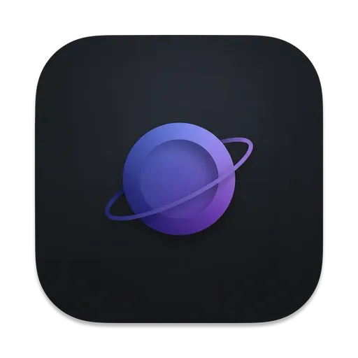

<p align="center">
  
</p>

<h1 align="center">Mercury</h1>

<p align="center">
  <strong>API Testing for Purists.</strong><br>
  Instant startup. 60fps UI. $0 forever.
</p>

<p align="center">
  <a href="https://harry-kp.github.io/mercury/docs/getting-started">Documentation</a> •
  <a href="https://github.com/Harry-kp/mercury/releases">Download</a> •
  <a href="https://github.com/users/Harry-kp/projects/5">Roadmap</a> •
  <a href="#your-requests-are-files">Requests are files</a> •
  <a href="#why-mercury">Why Mercury</a> •
  <a href="#contributing">Contributing</a>
</p>

<p align="center">
  <a href="https://github.com/Harry-kp/mercury/releases"></a>
  
  <a href="https://github.com/Harry-kp/mercury/actions"></a>
  <a href="https://github.com/Harry-kp/mercury/blob/master/LICENSE"></a>
  
</p>

<p align="center">
  <a href="https://github.com/Harry-kp/mercury/stargazers"></a>
  <a href="https://github.com/Harry-kp/mercury/issues"></a>
  <a href="https://github.com/Harry-kp/mercury/pulls"></a>
  <a href="https://github.com/Harry-kp/mercury/discussions"></a>
</p>

<p align="center">
  
</p>

<p align="center">
  <sub><a href="assets/media/demo.mp4">Watch in higher quality (MP4, 32s)</a></sub>
</p>

## Quick start

```bash
brew install --cask harry-kp/tap/mercury
```

Launch from **Applications**, or run `mercury`. Universal build — Apple Silicon and Intel.

> The first launch says the developer cannot be verified: right-click Mercury in Applications and choose **Open**. Mercury is unsigned because a Developer ID costs $99/year.

<details>
<summary><strong>Windows, Linux, or without Homebrew</strong></summary>

**macOS / Linux**

```bash
curl --proto '=https' --tlsv1.2 -LsSf https://github.com/Harry-kp/mercury/releases/latest/download/mercury-installer.sh | sh
```

**Windows (PowerShell)**

```powershell
irm https://github.com/Harry-kp/mercury/releases/latest/download/mercury-installer.ps1 | iex
```

Then run `mercury`. The installer puts the binary in `~/.cargo/bin` — if the shell can't find it, restart your terminal.

On Windows, SmartScreen says "Windows protected your PC": click **More info** → **Run anyway**.

On Linux, to get it in your app launcher:

```bash
cat > ~/.local/share/applications/mercury.desktop << 'EOF'
[Desktop Entry]
Name=Mercury
Exec=$HOME/.cargo/bin/mercury
Type=Application
Categories=Development;
EOF
```

**Manual download** — [every platform, from Releases](https://github.com/Harry-kp/mercury/releases).

**From source** — `git clone`, then `cargo build --release`.

</details>

<details>
<summary><strong>macOS says Mercury is damaged, or won't open</strong></summary>

Right-click in Applications → **Open** is the normal path. If macOS refuses outright:

```bash
xattr -d com.apple.quarantine /Applications/Mercury.app
```

For the shell installer's binary rather than the app bundle:

```bash
xattr -d com.apple.quarantine ~/.cargo/bin/mercury
```

The Homebrew cask ships a signed, sealed universal `.app`. Don't hand-build a `Mercury.app` around the bare binary — an unsigned bundle is what makes macOS call it damaged instead of merely unverified.

</details>

---

## Your requests are files

A workspace is just a folder. Subfolders are collections, and every `*.json` file is one request:

```
api/
├── .env.dev
├── .env.production
├── users/
│   ├── list-users.json
│   └── create-user.json
└── health.json
```

```json
{
  "method": "POST",
  "url": "{{BASE_URL}}/users",
  "headers": {
    "Authorization": "Bearer {{TOKEN}}",
    "Content-Type": "application/json"
  },
  "body": "{\"name\": \"Ada\"}"
}
```

Grep it, diff it, commit it, edit it in VS Code — Mercury picks up outside edits live. `headers` and `body` are optional, and headers are written in sorted order so git diffs stay clean.

**Environments** are `.env` files in the workspace root. Pick one from the top-right menu or cycle with `⌘ E`; `{{NAME}}` is substituted into the URL, headers and body when you send. Undefined variables are flagged on the tab that holds them. Production shows in red, staging in amber.

```bash
# .env.dev
BASE_URL=http://localhost:3000
TOKEN="dev token"
```

---

## Why Mercury

- **Native, not Electron.** Rust + egui draw directly on the GPU. One ~9 MB binary, no runtime, no splash screen.
- **Local only.** No account, no cloud, no telemetry. Your secrets stay on your disk.
- **Keyboard first.** `⌘ K` opens a palette over every request and command, `⌘ F` finds anything in a response, `?` lists the rest.
- **No setup tax.** Type `localhost:3000/api`, pick JSON or Form, hit send. Mercury fills in the scheme, the `Content-Type` and the decoding so the first request works.
- **Light or dark.** Follows your system theme, or `⌘ D` pins one. Vector icons and bundled fonts, so it looks the same on every OS.

### What's in it

- **Collections** — create, rename, duplicate and delete from the sidebar; outside edits sync live and changes auto-save.
- **Auth** — Basic, Bearer or a custom `Authorization` value, always in sync with the Headers tab.
- **Query params** — a table that stays in sync with the URL, both ways.
- **cURL** — paste a `curl …` command into the URL bar to import it; `⌘ ⇧ C` copies the request back out.
- **Import** — Postman v2.1 and Insomnia (JSON or YAML), with their variables, auth and bodies.
- **Responses** — pretty-printed and highlighted JSON, XML and HTML; headers and cookies; `⌘ F` to search; save images, binaries or large bodies to a file.
- **History** — your last 50 requests from the past 7 days, with full responses. **Recent** keeps unsaved requests you've sent.
- **Cookies** — kept for the session, so login flows just work.

---

## Shortcuts

`⌘` is `Ctrl` on Windows and Linux. Press `?` in the app for this list.

| Shortcut | Action |
|----------|--------|
| `⌘ ⏎` | Send request |
| `⌘ K` | Command palette |
| `⌘ N` | New request |
| `⌘ S` | Save request |
| `⌘ O` | Open folder |
| `⌘ L` | Focus URL bar |
| `⌘ E` | Next environment |
| `⌘ H` | Toggle history |
| `⌘ R` | Toggle raw response |
| `⌘ D` | Toggle light / dark |
| `⌘ F` | Find in response |
| `⌘ ⇧ C` | Copy as cURL |
| `⌘ ⇧ F` | Focus mode |
| `?` | Keyboard shortcuts |
| `Esc` | Close find / cancel request / close dialog / clear filter |

`Tab` moves between controls and `Space` activates the one you land on, so everything is reachable without a mouse.

---

## Defaults

There's no settings screen. These are fixed:

| | |
|---|---|
| Timeout | 30 seconds |
| Redirects | Followed (up to 10) |
| Largest response downloaded | 10 MB |
| Largest body shown inline | 100 KB (bigger ones offer **Save**) |
| App data | `~/.mercury/` (session, recent, history). Set `MERCURY_HOME` to use another folder. |

---

## What Mercury is NOT

We deliberately don't build cloud sync, team collaboration, AI assistants, plugins, user accounts or analytics. They aren't missing features; we chose to leave them out.

---

## Contributing

PRs are welcome. See [CONTRIBUTING.md](CONTRIBUTING.md). The repo is set up for Claude Code: [CLAUDE.md](CLAUDE.md) holds the conventions, and `/fix-issue <number>` runs the whole fix-to-merge loop.

```bash
cargo run      # run the app
cargo test     # unit tests + a headless UI smoke test
```

## License

MIT. Do whatever you want.

---

<p align="center">
  Built with obsessive minimalism.<br>
  <a href="https://github.com/Harry-kp">@Harry-kp</a>
</p>
